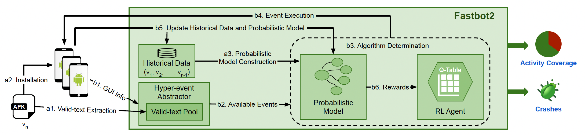
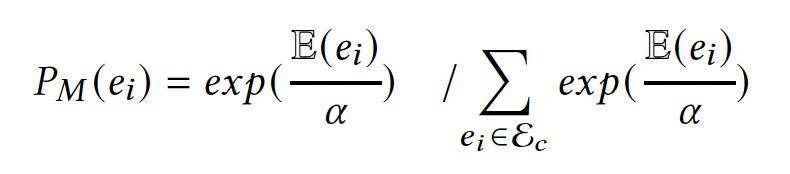
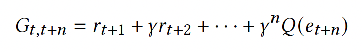

## Fastbot_Android 介绍   
基于 Model-based Testing 结合机器学习、强化学习的APP 稳定性测试工具  

## 优势：
1. Android 多 os 兼容：
 同时兼容 Android 5～14，兼容国内各厂商定制化的 Android 系统及原生 Android 系统；
2. 事件快速注入：
 继承原生 Monkey 的优势，快速点击，每秒最高可发送 12 个事件；
3. 专家系统：
 不同业务线支持不同的个性化需求，业务深度定制化；
4. 智能化测试：
     基于 Model-based 边遍历边建模，利用强化学习等算法做高收益决策；

## 原理：

Fastbot 的内部决策方案采用了将概率模型和强化学习模型结合的探索方式，目的是为了更快地并且尽可能多地探索应用中的页面。

Fastbot 包含两部分代码，一层是 Java，主要用于读取决策，并将决策转化为安卓设备可以执行的代码，从而操作设备；另外一层是 CPP，主要用于读取用户偏好，生成决策，并将决策转化为 JSON 格式的信息传递给 Java 层。

下面介绍 Fastbot 的 CPP 层中决策生成的核心，主要包含两个部分：
1. 概率模型 (Probabilistic Model)

概率模型，如 Fastbot 结构图所示，旨在根据曾经探索的页面的情况，对当前的备选组件进行挑选，从中选出最有可能触发未曾探索过的页面的组件，也就更有可能提升测试结果的 Activity 覆盖率。当页面中有某些组件未在此轮测试中被触发时，Fastbot 会调用概率模型，从历史的经验中选择最好的一个组件。

具体来说，对于当前一个潜在可以交互的组件 e，Fastbot 会根据之前探索的情况读取这个组件 e 曾经可以触发的 Activity，并将目前本轮探索到的 Activity 与历史数据进行对比。如果目前 Fastbot 并没有触发到组件 e 中曾经触发过的部分 Activity，并且相较于当前页面的其他组件来说，此组件 e 仍未被触发的 Activity 数量最多，那么此组件 e 就会被概率模型选中。如下图所示，概率模型会计算每一个 e 的概率，E(e) 代表此组件 e 之前所触发的 Activity 中未在本轮中被触发的比例。
<p align="center">

</p>
需要说明的是，此概率模型会在 Fastbot 的过程中随时保存，并且也会在下一次测试的时候被使用。这也是此模型被称为概率模型的原因，因为它记录了应用的历史探索的情况。

如果此应用从未被测试过，也并未储存过概率模型，那么 Fastbot 会以随机选择组件的方式应对冷启动的问题。

2. 强化学习模型 (Reinforcement Learning Model)

Fastbot 采用了 Sarsa N-Step 算法作为强化学习模型，如 Fastbot 结构图所示。当页面中的所有组件都被触发过之后，Fastbot 会使用强化学习模型，利用本次 Fastbot 探索的信息，选取当前最适合触发的组件。

此强化学习 Agent 会根据当前探索页面的情况计算奖励，并更新 N 步前的状态的 Q 值，将 Q 值存储到临时的 Q 表。Q 表中记录的状态的 Q 值是强化学习模型做下一步决策的依据。在这里，状态代表了某个时间步所触发的组件，以及组件所在的页面。强化学习模型会利用 Q 表对下一个待触发的组件进行排序决策，选择最可能触发新的页面的组件。计算时间步为 t 的 q 值的方法如下所示：

<p align="center">
 </br>

 </br>
</p>

具体来说，对于时间步为t的状态，Sarsa N-Step 会延迟到时间步为 t+N 时再进行更新。在此过程中记录每一个状态的奖励，利用这些记录好的信息更新 q 值。也就是用 t+1~t+N-1 的 r 和 t+N 的 Q 值计算 G，并利用这个计算好的 G 和 t 时刻的 Q 值更新 Q 值。

一般来说，若需要做下一步决策，直接挑选具有最大 Q 值的状态（组件）即可，但是这可能会使得模型过分依赖历史经验，而缺少一些随机性的决策。因此在对当前可选的组件进行排序的过程中，会为这些 Q 值引入一个随机值。在引入随机值后，强化学习模型选择具有最高 Q 值对应的那个组件，进行下一次探索。

关于更多 Fastbot 的细节，请参阅论文《Fastbot2: Reusable Automated Model-based GUI Testing forAndroid Enhanced by Reinforcement Learning》


## 编译方法
编译 Fastbot 的 apk 文件 monkey.apk 的具体方法。

本项目的编译依赖于 gradle，所以请首先安装 gradle。由于 gradle 版本众多，不同版本之间的兼容性不同，因此推荐使用 sdkman 下载、管理不同版本的 gradle。具体安装、使用 sdkman 的流程可参见：https://sdkman.io/

简而言之，若要安装 sdkman，请在 shell 中执行如下命令：

```shell
curl -s "https://get.sdkman.io" | bash
```

安装好 sdkman 后，请 cd 到 Fastbot 的项目文件夹中打开 shell，在 shell 中执行如下命令：
```shell
sdk install gradle 7.6.2 
```
```shell
gradle wrapper
```

本项目依赖 ndk 和 cmake，在安装好 gradle 后，请安装安卓开发所需的 SDK，执行如下命令，安装本项目所需的特定版本的 ndk 和 cmake。当然，你也可以修改 monkey 目录下的 build.gradle 文件，将 ndk 和 cmake 的版本修改为你的开发环境中的版本。
```shell
sdkmanager "cmake;3.18.1"
sdkmanager "ndk;25.2.9519653"
```

之后，输入如下的命令： 
```shell
./gradlew clean makeJar
~/Library/Android/sdk/build-tools/28.0.3/dx --dex --output=monkeyq.jar monkey/build/libs/monkey.jar
```
待编译流程结束后，可以在根目录中看到 monkeyq.jar 文件。此文件即为最终编译好的 Fastbot java 包。

之后，编译so文件，请运行：
```shell
sh ./build_native.sh
```
编译流程结束后，可以在 libs 目录中看到 .so 文件。此文件目录即为最终编译好的 Fastbot so 包。


## 本地接入
### 环境预备
* 支持 Android 5，6，7，8，9，10，11，12，13，14 真机及模拟器
* 将 `framework.jar fastbot-thirdpart.jar monkeyq.jar` push 到手机上某个目录中，建议/sdcard，push `libs/* ` 到 `/data/local/tmp/`
    ```shell
    adb push *.jar /sdcard
    adb push libs/* /data/local/tmp/
    ```


### shell运行
* 添加限定词，可提升模型， `aapt2` 可根据本机环境替换为 `aapt`，如果提示不可用，需要添加到 `PATH` 环境变量中， 示例具体路径为 ``` ${ANDROID_HOME}/build-tools/28.0.2/aapt2```

    ```shell
    aapt2 dump  --values strings  [install_package_path.apk] > max.valid.strings
    adb push max.valid.strings /sdcard 
    ```
* 启动 Fastbot
    ```shell
    adb -s 设备号 shell CLASSPATH=/sdcard/monkeyq.jar:/sdcard/framework.jar:/sdcard/fastbot-thirdpart.jar exec app_process /system/bin com.android.commands.monkey.Monkey -p 包名 --agent reuseq --running-minutes 遍历时长 --throttle 事件频率 -v -v
    ```

### 参数说明
1. `-s 设备号 ` 多个设备需要指定设备号，单独设备无需此-s参数
2. `-p 包名 ` 遍历app的包名，-p+包名
3. `--agent reuseq ` 遍历模式，无需更改
4. `--running-minutes 遍历时长(分钟)` # 遍历时间：--running-minutes 时间
5. `--throttle 事件频率`  遍历事件频率，建议为500-800
7. 可选参数
    * `--bugreport ` 崩溃时保存bug report log
    * `--output-directory /sdcard/xxx` log/crash 另存目录

###  结果说明
1. Crash、ANR 捕获
    * 捕获到Java Crash、ANR、Nativie Crash会以追加方式写入/sdcard/crash-dump.log文件
    * 捕获的Anr 同时也会写入 `/sdcard/oom-traces.log` 文件
2. Activity覆盖率统计
    * 正常跑完Fastbot会在当前shell中打印totalActivity（总activity列表），ExploredActivity（遍历到的activity列表）以及本次遍历的总覆盖率
    * 总覆盖率计算公式： `coverage = testedActivity / totalActivities * 100`

### 注意事项
  totalActivities：通过framework接口 PackageManager.getPackageInfo 获取，这包含app中所有的Activity，其中也包含了很多废弃、不可见、不可达等Activity


## 专家系统

### 自定义输入法（自动输入+屏蔽输入栏）
ADBKeyBoard在输入栏自动输入内容，屏蔽UI输入法

**适用需求：** 遇到搜索栏乱输入，想要输入指定字符

**环境准备：**  下载 ADBKeyBoard，并在手机端中设置为默认输入法 ADBKeyBoard下载地址， 
生效后，当遇到输入栏ADBKeyBoard不会弹起ui输入栏，会显示 `ADB Keyboard{ON} tarbar`

1. 随机输入字符串：
    * 配置 `max.config` 中 `max.randomPickFromStringList = false `  
        * 在pc端新建 `max.config` 文件（文件名称不可更改）
        * 输入 `max.randomPickFromStringList = false`
        * 通过以下命令将 `max.config` 文件push到手机端
            ```
            adb push max.config /sdcard
            ```
2. 从文件中随机读取字符串输入
    * 配置 `max.config` 中 `max.randomPickFromStringList = true `  
        * 在pc端新建 `max.strings` 文件（文件名称不可更改）
        * 输入想要输入的字符串，字符串结束要换行
        * 通过以下命令将文件push到手机端
            ``` 
            adb push max.strings /sdcard
            ```
        
3. 对文本控件输入fuzzing
   * 将项目中 test 目录中 `max.fuzzing.strings`文件（max.fuzzing.strings文件存在即生效），参考：https://github.com/danielmiessler/SecLists/blob/master/Fuzzing/big-list-of-naughty-strings.txt
   * 文件中输入想要输入的字符串，字符串结束换行
   * 通过以下命令将文件push到手机端
        ``` 
        adb push test/max.fuzzing.strings /sdcard
        ```
   * fuzz概率如下：
        ``` 
        1. 50% 概率输入fuzzing.strings中某个string
        2. 35% 概率输入被测试 App 历史页面中text/desc文本内容（不存在max.fuzzing.strings文件时概率提高到85%）
        3. 15% 概率不输入
        ```

### 自定义事件序列
手动配置 Activity 的路径（UI自动化用例）

**适用需求：** 场景覆盖不全，通过人工配置到达 Fastbot 遍历不到的场景， 或自定义操作序列（例如前置登录等）
1. 在pc端新建 `max.xpath.actions` 文件（文件名称不可更改）
2. 编写事件序列配置（case）：
  
    * `prob`：发生概率，"prob"：1,代表发生概率为100%
    * `activity`：所属场景，详见：三.获取当前页面所属的 Activity
    * `times`：重复次数，默认为1即可
    * `actions`：具体步骤的执行类型
    * `throttle`：action 间隔事件（ms）
    > action 支持以下类型：必须大写
    * `CLICK`：点击，想要输入内容在 action 下补充 text，如果有 text 则执行文本输入
    * `LONG_CLICK`：长按
    * `BACK`：返回
    * `SCROLL_TOP_DOWN`：从上向下滚动
    * `SCROLL_BOTTOM_UP`：从下向上滑动
    * `SCROLL_LEFT_RIGHT`：从左向右滑动
    * `SCROLL_RIGHT_LEFT`：从右向左滑动


*  **注意**: 存在切换页面情况：
        * activity 会跳转，actions 也应该拆分（同一个 activity 不需要做拆分）
    格式为图下：从 prob 开始写下一个 activity
  


3. 编写好文件后，可在 [json.cn](http://json.cn) 中检查无误后，推送到手机端中
    ```
    adb push max.xpath.actions /sdcard   
    ```
4. 有用的经验：
   * 包名的获取方式（需要配置好 ADB 命令）：
     * `aapt dump badging [apk路径] ` #mac 系统直接拖动 apk 文件到命令行

   * 使用 [Maxim](https://github.com/zhangzhao4444/Maxim) 获取当前控件所属的 activity
        ```
        adb shell CLASSPATH=/sdcard/monkey.jar:/sdcard/framework.jar exec app_process /system/bin tv.panda.test.monkey.api.CurrentActivity
        ```
    头条登录页面的所属 activity
  

   * 定位当前页面的控件
      * 使用Android SDK自带的页面属性检查工具 UiAutomatorViewer（需提前配置好Android SDK）
        ```
            ${ANDROID_HOME}/tools//bin/uiautomatorviewer
        ```


            对于Mac用户，此命令uiautomatorviewer可能会运行出错，解决方案请参考：https://github.com/android/android-test/issues/911#issuecomment-849389068。

   * 使用[Maxim](https://github.com/zhangzhao4444/Maxim) 在终端查看当前Tree结构
        ```
        adb shell CLASSPATH=/sdcard/monkey.jar:/sdcard/framework.jar exec app_process /system/bin tv.panda.test.monkey.api.Dumptree
        ```
  

    * 尽量使用`resource-id`作为xpath路径，也可以组合使用比如`"xpath": "//*[@resource-id='xxx'and @text='xx']"`
    
* 使用Fastbot的--top-activity命令确定当前设备所显示的activity的具体信息：
     ```
   adb shell CLASSPATH=/sdcard/monkeyq.jar:/sdcard/framework.jar:/sdcard/fastbot-thirdpart.jar exec app_process /system/bin com.android.commands.monkey.Monkey --top-activity
   ```
  * 输出信息
    ```
    [Fastbot][2023-08-03 20:37:20.108] Top activity name is:com.ss.android.article.news.activity.MainActivity（编写测试自定义序列 max.xpath.actions的过程中，请使用此部分作为activity的信息）
    [Fastbot][2023-08-03 20:37:20.108] Top package name is:com.ss.android.article.news
    [Fastbot][2023-08-03 20:37:20.108] Top short activity name is:.activity.MainActivity
    ```


### 场景细粒度控制
手动配置黑、白名单配置

**适用需求** 单独覆盖几个场景或屏蔽一些不必要场景

1. Activity白名单配置（只覆盖白名单内的activity）
    * 在PC端新建 `awl.strings`文件（名称固定为：awl.strings）
    * 在文件中写入Activity的名称，例如
    
    * 将 `awl.strings` 文件push到手机端的sdcard目录下, 目录必须为sdcard
        ```
        adb push awl.strings  /sdcard 
        ```
    * 运行命令时添加以下参数：`--act-whitelist-file  /sdcard/awl.strings`
    
        ```
        adb -s 设备号 shell CLASSPATH=/sdcard/monkeyq.jar:/sdcard/framework.jar:/sdcard/fastbot-thirdpart.jar exec app_process /system/bin com.android.commands.monkey.Monkey -p 包名 --agent reuseq   --act-whitelist-file /sdcard/awl.strings --running-minutes 遍历时长 --throttle 事件频率 -v -v
        ```

2. Activity黑名单配置（黑名单内的activity不覆盖）
    * 在PC端新建 `abl.strings` 文件（名称固定为：abl.strings）
    * 在文件中输入Activity的名称，同白名单方法一致
    * 将 `abl.strings` 文件push到手机端的sdcard目录下， 目录必须为sdcard
        ```
        adb push abl.strings  /sdcard 
        ```
    * 运行命令时添加以下参数：`--act-blacklist-file  /sdcard/abl.strings` 
        ```
        adb -s 设备号 shell CLASSPATH=/sdcard/monkeyq.jar:/sdcard/framework.jar:/sdcard/fastbot-thirdpart.jar exec app_process /system/bin com.android.commands.monkey.Monkey -p 包名 --agent reuseq  --act-blacklist-file /sdcard/abl.strings --running-minutes 遍历时长 --throttle 事件频率 -v -v
        ```

**注意：** *白名单和黑名单不能同时设置，按照非白即黑的原则，即设置了白名单则白名单外的都为黑名单。通过hook 可以监控activity 启动和切换，如果启动的是黑名单中的activity，就拒绝启动该activity，从ui上看就是点了跳转没效果*


### 屏蔽控件或区域
手动配置需要屏蔽的控件或区域

**适用需求：** 测试过程中“半路”中途退出登录，屏蔽退出登录按钮
1. 黑控件、黑区域
    * 在PC端新建 `max.widget.black` 文件（名称固定为：max.widget.black），文件内容配置格式如下：
    * 匹配条件activity：当activity与currentactivity一致时执行如下匹配
    * 屏蔽控件或区域共有三种方式：
        * 配置bounds：屏蔽某个区域，在该区域内的控件或坐标不会被点击，bounds 为 0.0～1.0 之间的一个百分比值。
        * 配置xpath：查找匹配的控件，屏蔽点击该控件。
        * 配置xpath+bounds：查找匹配的控件，当控件存在时屏蔽指定的区域，bounds 为 0.0～1.0 之间的一个百分比值。。
    
    * 将max.widget.black文件push到手机端的sdcard目录下，目录必须为sdcard
        ```shell
        adb push max.widget.black /sdcard 
        ```


2. 树剪枝屏蔽
    * 在PC端新建 `max.tree.pruning `文件（名称固定为：max.tree.pruning），文件内容配置格式如下：
    * 匹配条件activity：当activity与currentactivity一致时执行如下匹配
    * 剪枝方式：
        * 配置xpath：查找匹配的控件，改变控件属性，从而使控件屏蔽
    * 将 `max.tree.pruning` 文件push到手机端的sdcard目录下， /sdcard # 目录必须为sdcard
        ```
        adb push max.tree.pruning /sdcard 
        ```

### 支持反混淆
手动配置反混淆文件，针对每个包的混淆xpath做处理，这样可以使得配置在 App 版本迭代的过程中也可以通用

**适用需求：** 对黑、白名单、屏蔽控件和自定义事件中的xpath做反混淆转换 
* 配置混淆映射文件并push到手机端sdcard中, 名称固定为 `max.mapping`

    ```
    adb push resguard_mapping_NewsArticle_beta_version_v7.2.x_?????.txt /sdcard/max.mapping
    ```
* 配置反混淆文件，以自定义事件为例，在 `max.xpath.actions` 中配置混淆前的 resource-id
  ```
  adb -s 设备号 shell CLASSPATH=/sdcard/monkeyq.jar:/sdcard/framework.jar:/sdcard/fastbot-thirdpart.jar -p 包名 --agent reuseq --resMapping-file /sdcard/resguard_mapping_NewsArticle_beta_version_v7.2.x_?????.txt --running-minutes 遍历时长 --throttle 事件频率 -v -v # 标红部分为添加反混淆功能的参数
  ```
* 注：加载生效可以从logcat中查看，搜索关键词为：“loading resource mapping”


### 高速截图及打印xml结构
保存测试过程中的截图和打印xml结构

**适用需求：** 观察测试过程中的截图

1. 高速截图
    * 在PC 端新建 `max.config`文件，增加以下属性
    * `max.takeScreenshot = true`
    * `max.takeScreenshotForEveryStep = true`
    * `max.saveGUITreeToXmlEveryStep =true`
    * 将 `max.config` 文件push到手机端sdcard中 ， 目录必须为sdcard
        ```
        adb push max.config /sdcard 
        ```
    * 目录默认保存为手机端sdcard中，如需改变保存位置，在执行命令末尾添加 `--output-directory` 指定路径， --throttle 参数要 >200 才会截图
        ```shell
        adb -s 设备号 shell CLASSPATH=/sdcard/monkeyq.jar:/sdcard/framework.jar:/sdcard/fastbot-thirdpart.jar exec app_process /system/bin com.android.commands.monkey.Monkey -p 包名 --agent reuseq --running-minutes 遍历时长 --throttle 事件频率 -v -v --output-directory 指定路径
        ```
    * 注：--throttle参数要>200才会截图
        
###  Schema Event支持
app需支持允许第三方通过intent方式执行Schema跳转
1. Schema Event （schema跳转）
    * 在PC端新建 `max.schema` 文件

    * 将max.schema文件push到手机端的sdcard目录下， 目录必须为sdcard
        ```
        adb push max.schema  /sdcard
        ```
    * 配置max.config 增加 
       ``` shell
       max.execSchema = true
       max.execSchemaEveryStartup  = true  #每次启动app先执行schema
       ```
    * schema事件默认会在App启动后执行


### 权限自动授予
app 的权限弹窗处理， 
默认启动app前会自动授予app所需的所有权限，但如果想测试app运行过程中的动态权限弹窗
在 `max.config` 配置
* `max.grantAllPermission = false` Fastbot启动后不会自动授予各种权限；

* shell中增加 
    ```shell
     -p com.android.packageinstaller 
     -p com.android.permissioncontroller
     -p com.lbe.security.miui  # for (miui android 10)
     -p com.samsung.android.permissioncontroller #  for (samsung android 10)
    ```
增加其一弹窗相关package，可在权限弹窗时关闭弹窗

### Fuzzing数据集 【new】
提供各种格式image和video素材，用于遍历过程中执行选取各种类型的素材
* 执行shell命令
    ```shell
     adb push data/fuzzing/ /sdcard
     adb shell am broadcast -a android.intent.action.MEDIA_SCANNER_SCAN_FILE -d file:///sdcard/fuzzing
     ```


### 增加Fuzz和mutation event 【new】
模型推理执行某个action后按fuzzingrate几率生成5-10个fuzz序列，由如下event乱序组合
* 在PC端新建 `max.config`文件
* 增加以下参数
  * `max.fuzzingRate = 0.01D //0.01为Fuzz事件的总概率`
    ```shell
    fuzzingRate包含的事件(数字为默认概率):
    max.doRotateFuzzing = 0.15
    max.doAppSwitchFuzzing = 0.15
    max.doTrackballFuzzing = 0.15
    max.doNavKeyFuzzing = 0.15
    max.doKeyCodeFuzzing = 0.15
    max.doSystemKeyFuzzing = 0.15
    max.doDragFuzzing = 0.5
    max.doPinchZoomFuzzing = 0.15 
    max.doClickFuzzing = 0.7
     ```
  * `max.startMutation = 0.3D //启动Fastbot立刻设置mutation的几率，默认30%`
    ```shell
    fuzzingRate包含的事件(数字为默认概率，此概率为事件总概率):
    max.doMutationAirplaneFuzzing = 0.001
    max.doMutationMutationAlwaysFinishActivitysFuzzing = 0.1
    max.doMutationWifiFuzzing = 0.001
     ```
* 飞行模式、wifi开关这两个在Fastbot执行完会重置开启
* 将 `max.config` 文件push到手机端sdcard中，目录必须为sdcard
    ```
    adb push max.config /sdcard 
    ```

## 常见问题
1. 本地测试时，手机的顶部状态栏找不到了，怎么恢复呢？

    答：` adb shell wm overscan reset`   ps: 为了防止测试时点击到设置，影响测试效果，做的特殊设置
2. 小米手机运行 Fastbot 报错？

    答：开启 “开发者选项” -> "USB调试（安全设置）允许通过usb调试修改权限或模拟点击"

3. 运行Fastbot时无任何log，启动后就退出?

    答：需检查/sdcard/是否存在 `monkey.jar fastbot-thirdpart.jar framework.jar`。`部分机型发现adb push过去monkey.jar 自动被更名成monkey. 导致无法运行。        
4. vivo7.1运行Fastbot报错？

    答：关闭锁屏和开启usb模拟点击即可。

5. oppo运行Fastbot 1.0模式报错？ 

    答：oppo存在权限监控，需要在开发者-> 开启 禁止权限监控 即可
  


6. 报错 `NoClassDefFoundError ` `Lcom/google/gson/GsonBuilder`?
    
    答：需按照 Usage 所写，将项目下所有 jar `monkey.jar fastbot-thirdpart.jar framework.jar` push 到 `/sdcard`中，并且注意按照文档中运行命令 classpath 包含 `fastbot-thirdpart.jar`


7. 报错 Error: `Could not load library` `dlopen failed! libfastbot_native.so`

    答：需按照 Usage 所写，将项目下所有libs文件push到手机中  `adb push libs/* /data/local/tmp/` 
 
