## Fastbot_Android介绍   
基于model-based testing 结合机器学习、强化学习的APP 稳定性测试工具  

## 优势：
1. Android多os兼容：

    同时兼容Android5-11，兼容国内各厂商定制化的Android系统及原生Android系统
2. 事件快速注入：

    继承原生Monkey的优势，快速点击，每秒最高可发送12个事件
3. 专家系统：

    不同业务线支持不同的个性化需求，业务深度定制化
4. 智能化测试：

    基于model-based 边遍历边建模，利用强化学习等算法做高收益决策
5. 跨平台：

     支持非标准化控件，YOLOv3、ocr、cv分割等UI图像识别能力
> 2021.09 更新
5. 模型复用
    
    支持模型复用，模型文件会自动存储在 `/sdcard/fastbot_[包名].fbm`，启动 fastbot 时如果此文件存在则默认加载模型，运行过程中每隔十分钟会覆盖存储一次，用户可根据需求删除或拷贝此文件


> 相关： [Fastbot-iOS](https://github.com/bytedance/Fastbot_iOS) 

## 本地接入
### 环境预备
* 支持 Android 5，6，7，8，9，10，11真机及模拟器
* 将 `framework.jar fastbot-thirdpart.jar  monkeyq.jar` push 到手机上某个目录中，建议/sdcard
    ```
    adb push *.jar /sdcard
    adb push libs/* /sdcard/data/local/tmp/
    ```


### shell运行
* 添加限定词， `aapt2` 可根据本机环境替换为 `aapt`，如果提示不可用，需要添加到 `PATH` 环境变量中， 具体路径为 ``` ${ANDROID_HOME}/build-tools/28.0.2/aapt2```

    ```shell
    aapt2 dump  --values strings  [install_package_path.apk] > max.valid.strings
    adb push max.valid.strings /sdcard 
    ```
* 启动 Fastbot
    ```  shell
    adb -s 设备号 shell CLASSPATH=/sdcard/monkeyq.jar:/sdcard/framework.jar:/sdcard/fastbot-thirdpart.jar exec app_process /system/bin com.android.commands.monkey.Monkey -p 包名 --agent reuseq --running-minutes 遍历时长 --throttle 事件频率 -v -v
    ```

### 参数说明
1. `-s 设备号 ` 多个设备需要指定设备号，单独设备无需此-s参数
2. `-p 包名 ` 遍历app的包名，-p+包名
3. `--agent reuseq ` 遍历模式，无需更改
4. `--running-minutes 遍历时长(分钟)` # 遍历时间：--running-minutes 时间
5. `--throttle 事件频率`  遍历事件频率，建议为500-800
7. 可选参数
    * `--bugreport ` 崩溃时保存bug report log
    * `--output-directory /sdcard/xxx` log/crash 另存目录

###  结果说明
1. Crash、ANR 捕获
* 捕获到Java Crash、ANR、Nativie Crash会以追加方式写入/sdcard/crash-dump.log文件
* 捕获的Anr 同时也会写入/sdcard/oom-traces.log文件
2. Activity覆盖率统计
* 正常跑完Fastbot会在当前shell中打印totalActivity（总activity列表），ExploredActivity（遍历到的activity列表）以及本次遍历的总覆盖率
* 总覆盖率计算公式： coverage = testedActivity / totalActivities * 100

### 注意事项
  totalActivities：通过framework接口 PackageManager.getPackageInfo 获取，这包含app中所有的Activity，其中也包含了很多废弃、不可见、不可达等Activity


## 专家系统

### 自定义输入法（自动输入+屏蔽输入栏）
ADBKeyBoard在输入栏自动输入内容，屏蔽UI输入法

**适用需求：** 遇到搜索栏乱输入，想要输入指定字符

**环境准备：**  下载 ADBKeyBoard，并在手机端中设置为默认输入法 ADBKeyBoard下载地址， 
生效后，当遇到输入栏ADBKeyBoard不会弹起ui输入栏，会显示 `ADB Keyboard{ON} tarbar`

1. 随机输入字符串：
    * 配置 `max.config` 中 `max.randomPickFromStringList = false `  
        * 在pc端新建 `max.config` 文件（文件名称不可更改）
        * 输入 `max.randomPickFromStringList = false`
        * 通过以下命令将 `max.config` 文件push到手机端
            ```
            adb push max.config /sdcard
            ```
2. 从文件中随机读取字符串输入
    * 配置 `max.config` 中 `max.randomPickFromStringList = true `  
        * 在pc端新建 `max.strings` 文件（文件名称不可更改）
        * 输入想要输入的字符串，字符串结束要换行
        * 通过以下命令将文件push到手机端
            ``` 
            adb push max.strings /sdcard
            ```

        

### 自定义事件序列
手动配置Activity的路径（UI自动化用例）

**适用需求：** 场景覆盖不全，通过人工配置到达 Fastbot 遍历不到的场景， 或自定义操作序列（例如前置登录等）
1. 在pc端新建 `max.xpath.actions` 文件（文件名称不可更改）
2. 编写事件序列配置（case）：
  
    * `prob`：发生概率，"prob"：1,代表发生概率为100%
    * `activity`：所属场景，详见：三.获取当前页面所属的Activity
    * `times`：重复次数，默认为1即可
    * `actions`：具体步骤的执行类型
    * `throttle`：action间隔事件（ms）
    > action 支持以下类型：必须大写
    * `CLICK`：点击，想要输入内容在action下补充text，如果有text 则执行文本输入
    * `LONG_CLICK`：长按
    * `BACK`：返回
    * `SCROLL_TOP_DOWN`：从上向下滚动
    * `SCROLL_BOTTOM_UP`：从下向上滑动
    * `SCROLL_LEFT_RIGHT`：从左向右滑动
    * `SCROLL_RIGHT_LEFT`：从右向左滑动

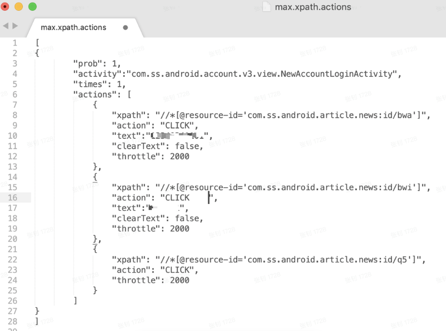

*  **注意**: 存在切换页面情况：
        * activity会跳转，actions也应该拆分（同一个activity不需要做拆分）
    格式为图下：从prob开始写下一个activity
  
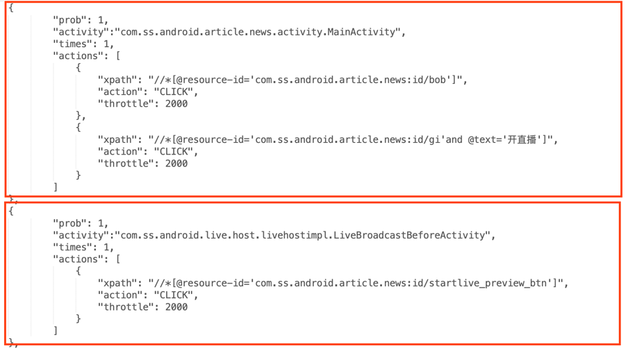

3. 编写好文件后，可在 [json.cn](http://json.cn)中检查无误后，推送到手机端中
    ```
    adb push max.xpath.actions /sdcard   
    ```
4. 有用的经验：
   * 包名的获取方式（需要配置好ADB命令）：
     * `aapt dump badging [apk路径] ` #mac系统直接拖动apk文件到命令行
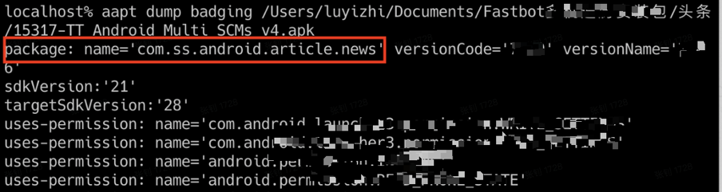
   * 使用 [Maxim](https://github.com/zhangzhao4444/Maxim) 获取当前控件所属的Activity
        ```
        adb shell CLASSPATH=/sdcard/monkey.jar:/sdcard/framework.jar exec app_process /system/bin tv.panda.test.monkey.api.CurrentActivity
        ```
    头条登录页面的所属activity
  
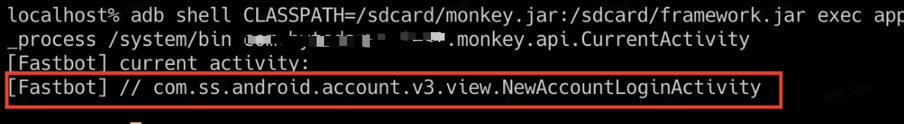
   * 定位当前页面的控件
      * 使用Android SDK自带的页面属性检查工具UiAutomatorViewer（需提前配置好Android SDK）
        ```
            ${ANDROID_HOME}/tools//bin/uiautomatorviewer
        ```

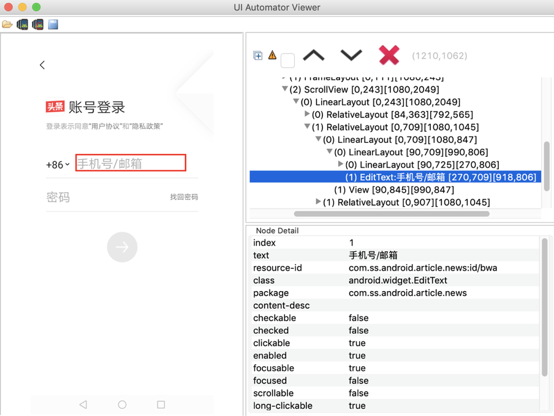
   * 使用[Maxim](https://github.com/zhangzhao4444/Maxim) 在终端查看当前Tree结构
        ```
        adb shell CLASSPATH=/sdcard/monkey.jar:/sdcard/framework.jar exec app_process /system/bin tv.panda.test.monkey.api.Dumptree
        ```
  
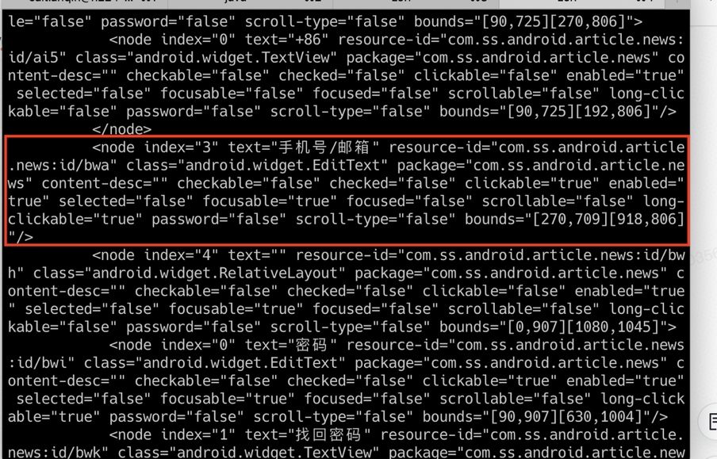
   * 尽量使用`resource-id`作为xpath路径，也可以组合使用比如`"xpath": "//*[@resource-id='xxx'and @text='xx']"`

### 场景细粒度控制
手动配置黑、白名单配置

**适用需求** 单独覆盖几个场景或屏蔽一些不必要场景

1. Activity白名单配置（只覆盖白名单内的activity）
    * 在PC端新建 `awl.strings`文件（名称固定为：awl.strings）
    * 在文件中写入Activity的名称，例如
    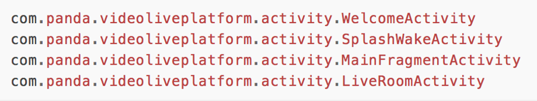
    * 将 `awl.strings` 文件push到手机端的sdcard目录下, 目录必须为sdcard
        ```
        adb push awl.strings  /sdcard 
        ```
    * 运行命令时添加以下参数：`--act-whitelist-file  /sdcard/awl.strings`
    
        ```
        adb -s 设备号 shell CLASSPATH=/sdcard/monkeyq.jar:/sdcard/framework.jar:/sdcard/fastbot-thirdpart.jar exec app_process /system/bin com.android.commands.monkey.Monkey -p 包名 --agent reuseq   --act-whitelist-file /sdcard/awl.strings --running-minutes 遍历时长 --throttle 事件频率 -v -v
        ```

2. Activity黑名单配置（黑名单内的activity不覆盖）
    * 在PC端新建 `abl.strings` 文件（名称固定为：abl.strings）
    * 在文件中输入Activity的名称，同白名单方法一致
    * 将 `abl.strings` 文件push到手机端的sdcard目录下， 目录必须为sdcard
        ```
        adb push abl.strings  /sdcard 
        ```
    * 运行命令时添加以下参数：`--act-blacklist-file  /sdcard/abl.strings` 
        ```
        adb -s 设备号 shell CLASSPATH=/sdcard/monkeyq.jar:/sdcard/framework.jar/sdcard/fastbot-thirdpart.jar exec app_process /system/bin com.android.commands.monkey.Monkey -p 包名 --agent reuseq  --act-blacklist-file /sdcard/abl.strings --running-minutes 遍历时长 --throttle 事件频率 -v -v 
        ```

**注意：** *白名单和黑名单不能同时设置，按照非白即黑的原则，即设置了白名单则白名单外的都为黑名单。通过hook 可以监控activity 启动和切换，如果启动的是黑名单中的activity，就拒绝启动该activity，从ui上看就是点了跳转没效果*


### 屏蔽控件或区域
手动配置需要屏蔽的控件或区域

**适用需求：** 测试过程中“半路”中途退出登录，屏蔽退出登录按钮
1. 黑控件、黑区域
    * 在PC端新建 `max.widget.black` 文件（名称固定为：max.widget.black），文件内容配置格式如下：
    * 匹配条件activity：当activity与currentactivity一致时执行如下匹配
    * 屏蔽控件或区域共有三种方式：
        * 配置bounds：屏蔽某个区域，在该区域内的控件或坐标不会被点击。
        * 配置xpath：查找匹配的控件，屏蔽点击该控件。
        * 配置xpath+bounds：查找匹配的控件，当控件存在时屏蔽指定的区域。
    
    * 将max.widget.black文件push到手机端的sdcard目录下
        ```
        adb push max.widget.black /sdcard # 目录必须为sdcard
        ```
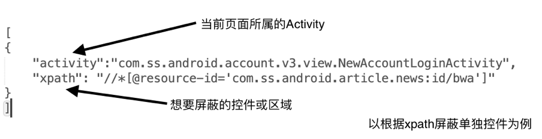

2. 树剪枝屏蔽
    * 在PC端新建 `max.tree.pruning `文件（名称固定为：max.tree.pruning），文件内容配置格式如下：
    * 匹配条件activity：当activity与currentactivity一致时执行如下匹配
    * 剪枝方式：
        * 配置xpath：查找匹配的控件，改变控件属性，从而使控件屏蔽
    * 将 `max.tree.pruning` 文件push到手机端的sdcard目录下， /sdcard # 目录必须为sdcard
        ```
        adb push max.tree.pruning /sdcard 
        ```

### 支持反混淆
手动配置反混淆文件，针对每个包的混淆xpath做处理，这样可以使得配置在 App 版本迭代的过程中也可以通用

**适用需求：** 对黑、白名单、屏蔽控件和自定义事件中的xpath做反混淆转换
* 配置混淆映射文件并push到手机端sdcard中, 名称固定为 `max.mapping`
    ```
    adb push resguard_mapping_NewsArticle_beta_version_v7.2.x_?????.txt /sdcard/max.mapping
    ```
* 配置反混淆文件，以自定义事件为例，在 `max.xpath.actions` 中配置混淆前的 resource-id


### 高速截图及打印xml结构
保存测试过程中的截图和打印xml结构

**适用需求：** 观察测试过程中的截图

1. 高速截图
    * 在PC 端新建 `max.config`文件，增加以下属性
    * `max.takeScreenshot = true`
    * `max.takeScreenshotForEveryStep = true`
    * `max.saveGUITreeToXmlEveryStep =true`
    * 将 `max.config` 文件push到手机端sdcard中 ， 目录必须为sdcard
        ```
        adb push max.config /sdcard 
        ```
    * 目录默认保存为手机端sdcard中，如需改变保存位置，在执行命令末尾添加 `--output-directory` 指定路径， --throttle 参数要 >200 才会截图
        ```
        adb -s 设备号 shell CLASSPATH=/sdcard/monkeyq.jar:/sdcard/framework.jar exec app_process /system/bin com.android.commands.monkey.Monkey -p 包名 --agent robot         --running-minutes 遍历时长 --throttle 事件频率 -v -v --output-directory 指定路径
        ```
        
###  Schema Event支持
app需支持允许第三方通过intent方式执行Schema跳转
1. Schema Event （schema跳转）
    * 在PC端新建 `max.schema` 文件

    * 将max.schema文件push到手机端的sdcard目录下， 目录必须为sdcard
        ```
        adb push max.schema  /sdcard
        ``` 
    * 配置max.config 增加 
       ``` shell
       max.execSchema = true
       max.execSchemaEveryStartup  = true  #每次启动app先执行schema
       ```
    * schema事件默认会在App启动后执行

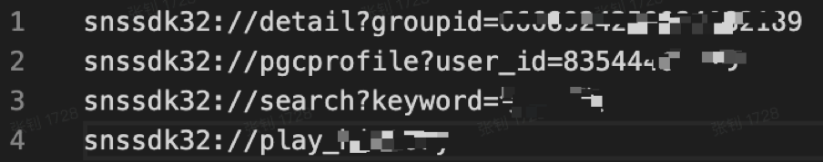

### 权限自动授予
app 的权限弹窗处理， 
默认启动app前会自动授予app所需的所有权限，但如果想测试app运行过程中的动态权限弹窗
在 `max.config` 配置
* `max.grantAllPermission = false` Fastbot启动后不会自动授予各种权限；

* shell中增加 
    ``` shell
     -p com.android.packageinstaller 
     -p com.android.permissioncontroller
     -p com.lbe.security.miui  # for (miui android 10)
     -p com.samsung.android.permissioncontroller #  for (samsung android 10)
    ```
增加其一弹窗相关package，可在权限弹窗时关闭弹窗
  
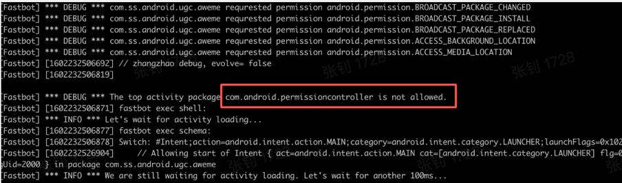
## 常见问题
1. 本地测试时，手机的顶部状态栏找不到了，怎么恢复呢？

    答：` adb shell wm overscan reset`   ps: 为了防止测试时点击到设置，影响测试效果，做的特殊设置
2. 小米手机运行 Fastbot 报错？

    答：开启 “开发者选项” -> "USB调试（安全设置）允许通过usb调试修改权限或模拟点击"

3. 运行Fastbot时无任何log，启动后就退出?

    答：需检查/sdcard/是否存在 `monkey.jar fastbot-thirdpart.jar framework.jar`。`部分机型发现adb push过去monkey.jar 自动被更名成monkey. 导致无法运行。        
4. vivo7.1运行Fastbot报错？

    答：关闭锁屏和开启usb模拟点击即可。
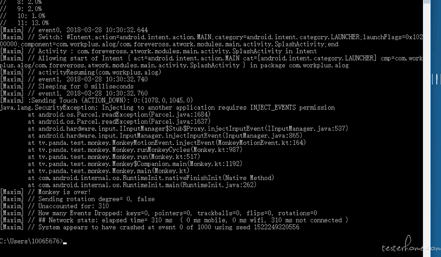
5. oppo运行Fastbot 1.0模式报错？ 

    答：oppo存在权限监控，需要在开发者-> 开启 禁止权限监控 即可
  
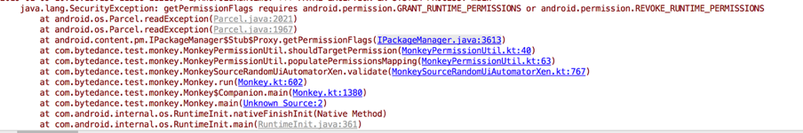


